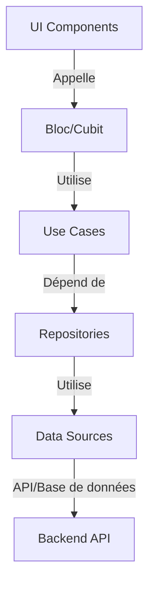

# Stocking Billing App

Une application Flutter moderne pour la gestion des stocks, des catégories et la facturation, avec un système d'authentification robuste et des rôles utilisateurs. Développée avec Flutter et une architecture propre, cette application offre une expérience utilisateur fluide et intuitive sur toutes les plateformes.

## Description

Cette application permet de gérer efficacement les stocks et la facturation. Elle est développée avec Flutter, offrant ainsi une expérience utilisateur fluide et moderne sur plusieurs plateformes. L'application propose une interface intuitive pour la gestion complète des produits, des catégories et des mouvements de stock, avec des fonctionnalités avancées de recherche et de filtrage.

## Fonctionnalités

### Authentification
- Connexion sécurisée avec JWT
- Gestion des rôles (Admin, Manager, Cashier)
- Protection des routes par rôle
- Déconnexion sécurisée

### Tableau de Bord
- Vue d'ensemble des statistiques
- Nombre total de produits et catégories
- Alertes de stock faible
- Valeur totale de l'inventaire
- Graphiques de distribution par catégorie

### Gestion des Catégories
- Création et édition de catégories
- Affichage détaillé des catégories avec statistiques
- Gestion complète des produits par catégorie
  - Consultation des produits d'une catégorie
  - Pagination côté client (25/50/100/Tout afficher)
  - Recherche par nom de produit
  - Interface intuitive avec indicateurs de chargement
- Interface utilisateur moderne et réactive avec design responsive
  - Grille adaptative (1 à 4 colonnes selon la taille de l'écran)
  - Cartes de catégories optimisées pour la lisibilité
  - Défilement fluide même avec de nombreuses catégories
  - Indicateurs visuels clairs pour le statut actif/inactif
- Mise à jour en temps réel du nombre de catégories
- Recherche et filtrage des catégories en temps réel
- Affichage précis du nombre de produits par catégorie
- Gestion des mouvements de stock par catégorie
- Support des produits appartenant à plusieurs catégories
- Métadonnées complètes (date de création/modification, utilisateur)

### Gestion des Utilisateurs (Admin)
- Création de nouveaux utilisateurs
- Visualisation de la liste des utilisateurs avec statut visuel
- Modification des informations utilisateur
- Désactivation/Activation des comptes avec raison
- Gestion des rôles et permissions
- Interface utilisateur intuitive avec indicateurs visuels

### Gestion des Produits
- Affichage en grille ou en liste des produits
- Cartes de produits détaillées avec :
  - Image du produit (placeholder si non définie)
  - Nom et référence
  - Description complète
  - Prix et quantité en stock
  - Statut de stock (Normal, Stock bas, Rupture)
  - Catégories associées
  - Métadonnées (date de création/modification, utilisateur)
- Recherche avancée par nom, référence ou description
- Filtrage par statut de stock et catégories
- Pagination optimisée pour les grandes listes
- Interface adaptative pour différents écrans

### Interface Utilisateur
- Design moderne et intuitif
- Thème sombre/clair
- Navigation fluide entre les écrans avec animations
- Indicateurs visuels pour les statuts utilisateur et produits
  - Badges colorés pour les statuts (Actif/Inactif, Stock bas, Rupture)
  - Icônes spécifiques pour les rôles et actions
  - Affichage clair des informations importantes
- Gestion des erreurs et feedback utilisateur
- Pagination intuitive avec contrôles de navigation
- Barres de recherche réactives avec filtre en temps réel
- Indicateurs de chargement et états vides personnalisés
- Interface responsive s'adaptant à toutes les tailles d'écran

## Améliorations Récentes

### 🚀 Optimisation des Performances - Juin 2024

#### Cache et Chargement des Données
- **Mise en cache des produits** pendant 5 minutes pour réduire les appels réseau
- **Chargement initial automatique** des produits au démarrage du formulaire
- **Mise à jour intelligente du cache** lors de l'ajout de nouveaux produits
- **Synchronisation des données** pour maintenir la cohérence entre les vues

#### Recherche Ultra-Rapide
- **Recherche locale** après le chargement initial pour des résultats instantanés
- **Algorithme de recherche optimisé** avec tri par pertinence
- **Limitation à 50 résultats** pour éviter les ralentissements
- **Délai de débordement (debounce)** de 200ms pour réduire le nombre de recherches

#### Optimisation de l'Interface Utilisateur
- **Mise à jour sélective des états** pour éviter les reconstructions inutiles
- **Gestion efficace de la mémoire** avec nettoyage des ressources
- **Vérification systématique du contexte (mounted)** avant les mises à jour
- **Feedback visuel amélioré** pendant les opérations de chargement

#### Gestion des Événements
- **Annulation des recherches en cours** lors de nouvelles saisies
- **Gestion des erreurs robuste** avec messages utilisateur clairs
- **Préservation de la sélection** lors des mises à jour de la liste
- **Optimisation des reconstructions de widgets** avec des clés appropriées

### Recherche et Interface Utilisateur - Optimisation Majeure

#### 🚀 Recherche Avancée
- **Recherche en temps réel** avec feedback visuel immédiat
- **Filtrage côté client** pour des résultats instantanés
- **Champ de recherche fixe** toujours accessible
- **Bouton de réinitialisation** pour effacer rapidement la recherche
- **Recherche sur plusieurs champs** (nom, référence, description)
- **Gestion des accents et de la casse** pour une recherche plus intuitive

#### 🎨 Interface Utilisateur Améliorée
- **Barre de recherche fixe** pour un accès permanent
- **Affichage des résultats dans le contexte** sans changement de vue
- **Messages d'état clairs** pour les résultats vides
- **Indicateur de recherche** pendant le filtrage
- **Design cohérent** avec le thème de l'application

### Gestion des Produits - Amélioration de la Pagination
- **Chargement de tous les produits** avec une seule requête pour une navigation fluide
- **Pagination optimisée** avec chargement par lots pour les grandes listes de produits
- **Bouton "Tout afficher"** pour accéder à l'ensemble du catalogue sans pagination
- **Gestion intelligente du cache** pour des performances optimales
- **Indicateurs de chargement** clairs pendant le chargement des données
- **Gestion des erreurs améliorée** avec retour automatique en mode paginé en cas de problème
- **Interface utilisateur réactive** qui s'adapte au mode d'affichage sélectionné
- **Recherche en temps réel** dans les listes de produits, même en mode "Tout afficher"
- **Performance optimisée** grâce à une gestion efficace de la mémoire
- **Expérience utilisateur cohérente** sur tous les appareils et toutes les tailles d'écran

### Historique des Ventes
- **Refonte complète de l'interface** avec un design moderne et intuitif
- **Système de tri avancé** permettant de basculer entre l'affichage du plus récent au plus ancien et inversement
- **Filtrage par date amélioré** avec sélection de plage personnalisée
- **Recherche en temps réel** dans les numéros de vente, montants et noms de clients
- **Indicateurs visuels** pour les différents statuts de vente (Terminée, Annulée, En attente)
- **Optimisation des performances** avec chargement progressif et mise en cache
- **Gestion des erreurs** améliorée avec retours utilisateur clairs
- **Interface responsive** s'adaptant à toutes les tailles d'écran
- **Support des gestes** pour des actions rapides
- **Export des données** au format CSV/PDF

### Gestion des Transactions
- **Tableau de bord des transactions** avec vue d'ensemble complète
- **Filtrage avancé** des transactions par période (aujourd'hui, semaine, mois, année, personnalisée)
- **Statistiques détaillées** par méthode de paiement
- **Graphiques interactifs** pour visualiser les tendances des ventes
- **Export des données** de transaction

### Interface Utilisateur
- **Refonte complète** de l'interface des transactions avec un design moderne
- **Filtres rapides** accessibles pour une navigation intuitive
- **Badges visuels** pour les statuts de transaction
- **Thème cohérent** avec le reste de l'application
- **Interface adaptative** pour tous les appareils (mobile, tablette, desktop)

### Performance
- Optimisation du chargement des listes de transactions
- Mise en cache intelligente des données fréquemment utilisées
- Réduction de la consommation mémoire lors de l'affichage des graphiques
- Chargement progressif des données pour une expérience fluide

### Sécurité
- Vérification des autorisations pour l'accès aux transactions
- Protection des données sensibles dans l'interface utilisateur
- Validation renforcée des entrées utilisateur
- Gestion sécurisée des données de paiement

### Nouvelles Fonctionnalités
- **Filtres de période rapides** (aujourd'hui, cette semaine, ce mois-ci, cette année)
- **Sélection de plage de dates personnalisée** avec un calendrier intuitif
- **Visualisation des données** avec des graphiques en camembert et en courbes
- **Recherche et tri** avancés dans la liste des transactions
- **Détails complets** de chaque transaction avec statut visuel
- Support multilingue (français, anglais)
- Sauvegarde et restauration des données

### Corrections de Bugs
- Correction des problèmes de navigation entre les écrans
- Amélioration de la gestion des erreurs réseau
- Correction des problèmes de rafraîchissement des données
- Optimisation de la consommation de la batterie

## Prérequis

- Flutter SDK (version ^3.7.2 ou supérieure)
- Dart SDK (version 3.1.0 ou supérieure)
- Un éditeur de code (VS Code, Android Studio, etc.)
- Backend API fonctionnel (voir dépôt backend pour plus d'informations)
- Connexion Internet pour le chargement des données
- Compte utilisateur avec les droits appropriés (Admin, Manager, ou Caissier)

## Configuration

### Variables d'environnement

Créez un fichier `.env` à la racine du projet avec les variables suivantes :

```
API_BASE_URL=votre_url_api
GOOGLE_MAPS_API_KEY=votre_cle_api_google_maps
```

### Configuration de l'application

Modifiez le fichier `lib/config/app_config.dart` selon vos besoins :

```dart
class AppConfig {
  static const String appName = 'Stocking Billing App';
  static const String apiBaseUrl = String.fromEnvironment('API_BASE_URL');
  static const String googleMapsApiKey = String.fromEnvironment('GOOGLE_MAPS_API_KEY');
  
  // Configuration de l'API
  static const Duration apiTimeout = Duration(seconds: 30);
  static const int maxRetryAttempts = 3;
  
  // Paramètres de l'application
  static const int itemsPerPage = 20;
  static const int maxImageSize = 5 * 1024 * 1024; // 5MB
}
```

## Démarrage rapide

1. **Installation des dépendances** :
   ```bash
   flutter pub get
   ```

2. **Lancement en mode développement** :
   ```bash
   flutter run -d chrome --web-port=3000
   ```

3. **Génération des builds** :
   - Pour Android : `flutter build apk --release`
   - Pour iOS : `flutter build ios --release`
   - Pour le web : `flutter build web --release`

## Architecture

L'application suit une architecture propre (Clean Architecture) avec les couches suivantes :

- **Présentation** : Contrôleurs, vues et modèles de vue
- **Domaine** : Logique métier et cas d'utilisation
- **Données** : Référentiels et sources de données
- **Infrastructure** : Services externes et API

### Diagramme d'architecture



## Tests

L'application inclut des tests unitaires et d'intégration :

- **Tests unitaires** : `test/`
- **Tests d'intégration** : `integration_test/`
- **Tests widget** : `test/widget_test.dart`

Pour exécuter les tests :

```bash
# Tous les tests
flutter test

# Tests spécifiques
flutter test test/auth/login_test.dart
```

## Déploiement

### Android

1. Générez un keystore :
   ```bash
   keytool -genkey -v -keystore ~/upload-keystore.jks -keyalg RSA -keysize 2048 -validity 10000 -alias upload
   ```

2. Configurez `android/app/build.gradle` avec les informations du keystore

3. Générez le bundle :
   ```bash
   flutter build appbundle
   ```

### iOS

1. Mettez à jour le bundle identifier dans `ios/Runner.xcodeproj`
2. Générez l'archive :
   ```bash
   flutter build ipa --export-options-plist=ios/exportOptions.plist
   ```

### Web

1. Générez les fichiers de production :
   ```bash
   flutter build web --release
   ```

2. Déployez le contenu du dossier `build/web` sur votre serveur

## Dépannage

### Problèmes courants

1. **Échec de la connexion à l'API**
   - Vérifiez la connexion Internet
   - Vérifiez l'URL de l'API dans la configuration
   - Vérifiez les logs du serveur

2. **Échec du chargement des images**
   - Vérifiez les permissions
   - Vérifiez les chemins des images
   - Vérifiez la taille des images

3. **Problèmes de performance**
   - Utilisez `ListView.builder` pour les longues listes
   - Optimisez les images
   - Évitez les reconstructions inutiles avec `const`

## 🤝 Contribution

Les contributions sont les bienvenues ! Voici comment contribuer au projet :

1. Forkez le projet
2. Créez une branche pour votre fonctionnalité (`git checkout -b feature/AmazingFeature`)
3. Committez vos modifications (`git commit -m 'Ajouter une fonctionnalité incroyable'`)
4. Poussez vers la branche (`git push origin feature/AmazingFeature`)
5. Ouvrez une Pull Request

### Bonnes pratiques de développement

- Suivez les conventions de code Dart/Flutter
- Écrivez des tests unitaires et d'intégration
- Documentez votre code
- Assurez-vous que toutes les fonctionnalités existantes fonctionnent toujours
- Vérifiez que votre code est propre et bien structuré

### Signaler un bug

Si vous trouvez un bug, veuillez ouvrir une issue en suivant le modèle fourni. Incluez :
- Une description claire et concise du bug
- Les étapes pour reproduire le bug
- Le comportement attendu
- Des captures d'écran si nécessaire
- La version de l'application et du système d'exploitation

## 📄 Licence

Ce projet est sous licence MIT - voir le fichier [LICENSE](LICENSE) pour plus de détails.

## 🙏 Remerciements

- [Flutter](https://flutter.dev/) - Le framework d'interface utilisateur de Google
- [Provider](https://pub.dev/packages/provider) - Gestion d'état
- [Dio](https://pub.dev/packages/dio) - Client HTTP
- [Shared Preferences](https://pub.dev/packages/shared_preferences) - Stockage local
- [Flutter SVG](https://pub.dev/packages/flutter_svg) - Support des images SVG
- [Flutter Animate](https://pub.dev/packages/flutter_animate) - Animations fluides
- Tous les contributeurs qui ont aidé à améliorer ce projet !

## API Endpoints

### Authentification
- POST `/auth/login` : Connexion
- POST `/auth/register` : Inscription

### Utilisateurs
- GET `/users/` : Liste des utilisateurs
- POST `/users/` : Création d'utilisateur
- PUT `/users/{id}` : Mise à jour d'utilisateur
- PUT `/users/deactivate/{id}` : Désactivation/Réactivation d'utilisateur

### Catégories
- GET `/categories/` : Liste des catégories avec pagination
- POST `/categories/` : Création d'une catégorie
- GET `/categories/{id}/products` : Liste des produits d'une catégorie
- GET `/categories/{id}/products/count` : Nombre de produits par catégorie
- GET `/categories/{id}` : Détails d'une catégorie
- PUT `/categories/{id}` : Mise à jour d'une catégorie
- DELETE `/categories/{id}` : Suppression d'une catégorie
- GET `/categories/{id}/products` : Produits d'une catégorie (avec recherche et pagination côté client)

## Sécurité

- Tokens JWT pour l'authentification
- Validation des rôles côté client et serveur
- Stockage sécurisé des informations sensibles
- Protection des routes par rôle
- Gestion des erreurs et exceptions

## Développement

### Configuration initiale
1. Cloner le dépôt
2. Installer les dépendances : `flutter pub get`
3. Configurer les variables d'environnement dans `.env`
4. Lancer l'application : `flutter run`

### Bonnes pratiques
- Suivre les conventions de code Flutter/Dart
- Documenter les nouvelles fonctionnalités
- Écrire des tests unitaires et d'intégration
- Utiliser des widgets réutilisables
- Gérer correctement les états de chargement et d'erreur
- Optimiser les performances pour les listes avec beaucoup d'éléments

### Structure du code
- `lib/screens/` : Contient tous les écrans de l'application
- `lib/widgets/` : Composants réutilisables
- `lib/services/` : Logique métier et appels API
- `lib/models/` : Modèles de données
- `lib/utils/` : Utilitaires et constantes

## Tests

Pour exécuter les tests :
```bash
flutter test
```

## Contribution

1. Fork le projet
2. Créer une branche pour votre fonctionnalité (`git checkout -b feature/nouvelle-fonctionnalite`)
3. Commiter vos changements (`git commit -am 'Ajout d\'une nouvelle fonctionnalité'`)
4. Pousser vers la branche (`git push origin feature/nouvelle-fonctionnalite`)
5. Ouvrir une Pull Request

### Bonnes pratiques
- Suivre les conventions de code Flutter/Dart
- Documenter le code
- Écrire des tests unitaires pour les nouvelles fonctionnalités
- Mettre à jour la documentation (README, commentaires, etc.)

## Licence

Ce projet est sous licence MIT.

## Contact
Jordan Jeuna
jeunaj3gmail.com

Pour toute question ou suggestion, n'hésitez pas.
